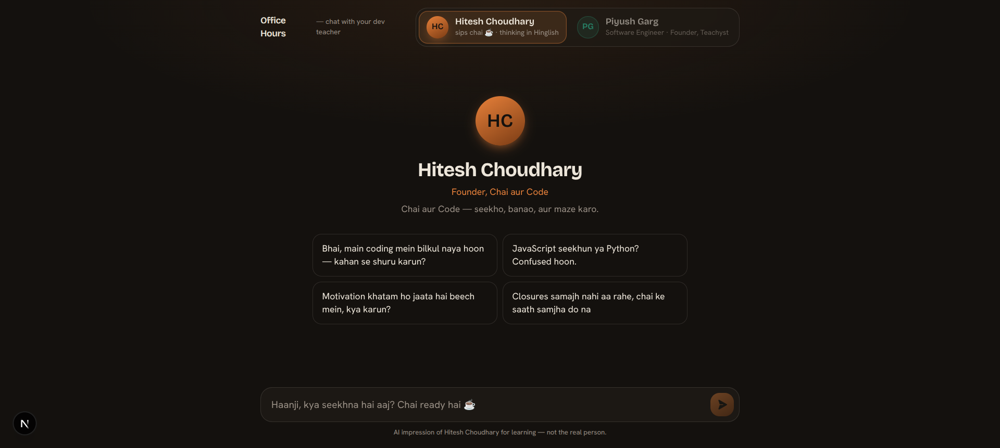

# Office Hours — Persona AI

Chat with an AI that talks like **Hitesh Choudhary** or **Piyush Garg** — their voice, teaching
style, and Hinglish, in one conversation you can switch between at any time.

Built for the "GenAI with JS 2026" assignment. Personas are grounded in each creator's publicly
observable style (see [`docs/PERSONAS.md`](docs/PERSONAS.md)).



## Features

- **Two personas, one thread** — switch between Hitesh and Piyush mid-conversation; the newly
  active persona sees the prior context and stays in character.
- **Authentic Hinglish voice** — hand-crafted per-persona system prompts + verbatim style anchors,
  optionally grounded with **RAG** over real YouTube transcripts / posts (pgvector).
- **Streaming** responses token-by-token (OpenRouter SSE).
- **Persistent chat** — anonymous cookie session, history stored in Postgres, survives reloads.
- **Markdown + syntax-highlighted code** with copy buttons (shiki).
- **"Office Hours" UI** — a warm, dark room that re-tints to each persona's accent on switch.
- **Rate limiting** — DB-backed daily cap per visitor (no extra service).

## Tech stack

Next.js 16 (App Router) · React 19 · TypeScript · Tailwind v4 + shadcn/ui · Prisma 7 + Postgres
(pgvector) · OpenRouter (chat + embeddings).

## Architecture

```
app/
  page.tsx              # renders the chat shell
  api/chat/route.ts     # POST: session → rate-limit → persist → RAG → stream from OpenRouter → persist
  api/messages/route.ts # GET: conversation history for the session
lib/
  personas.ts           # persona registry: bios, accents, starters, system prompts, few-shot anchors
  openrouter.ts         # streaming chat client (fetch + SSE)
  embeddings.ts         # embeddings via OpenRouter (768-dim)
  rag.ts                # pgvector similarity retrieval (degrades to [] when unused)
  session.ts            # anonymous cookie session
  ratelimit.ts          # DB-backed daily cap
  db.ts                 # Prisma client (pg driver adapter)
components/chat/         # ChatWindow, PersonaSwitcher, Composer, Markdown, CodeBlock, Avatar
scripts/ingest.ts       # RAG ingestion: transcripts/posts → chunk → embed → pgvector
prisma/schema.prisma    # Session, Message, PersonaChunk (vector 768)
setup/docker-compose.yml# local Postgres + pgvector
```

## Getting started

### 1. Prerequisites

- Node 20+
- An [OpenRouter](https://openrouter.ai/keys) API key (powers both chat and embeddings)
- Docker (for the local database) — or any Postgres with the `pgvector` extension

### 2. Install & configure

```bash
npm install
cp .env.example .env
```

Edit `.env` and set at least `OPENROUTER_API_KEY`. Pick a model your key can access
(default `openai/gpt-4o-mini`).

| Variable | Purpose |
| --- | --- |
| `OPENROUTER_API_KEY` | Chat + embeddings (required) |
| `OPENROUTER_MODEL` | Chat model id (default `openai/gpt-4o-mini`) |
| `EMBEDDINGS_MODEL` | Embedding model (default `openai/text-embedding-3-small`) |
| `DATABASE_URL` | Postgres connection string (with pgvector) |
| `DAILY_MESSAGE_LIMIT` | Messages per visitor per day (default 40) |
| `NEXT_PUBLIC_SITE_URL` | Site origin, for OpenRouter attribution |

### 3. Start the database

```bash
cd setup && docker compose up -d && cd ..
```

This runs Postgres 17 + pgvector on port **5434** (matching the default `DATABASE_URL`).

### 4. Create the schema

```bash
npx prisma db push   # creates tables + enables pgvector
```

### 5. Run

```bash
npm run dev
```

Open http://localhost:3000.

## Optional: RAG grounding

The app works great on style alone. To also ground answers in what the creators actually said:

1. Add real video ids / text snippets per persona in [`data/sources.json`](data/sources.json).
2. Run:

   ```bash
   npm run ingest
   ```

This loads each video's captions, chunks and embeds them, and stores vectors in `persona_chunks`.
The chat route then retrieves the most relevant chunks per question. See
[`docs/PERSONAS.md`](docs/PERSONAS.md) for the full data-collection method.

**Transcript backups (important for VPS/production).** YouTube caption scraping is unofficial and
often blocked on datacenter IPs, so ingestion is **cache-first**: every fetched transcript is saved
to [`data/transcripts/<persona>/<videoId>.txt`](data/transcripts/) and committed. On later runs (and
in production) ingest reads those files and **never needs to call YouTube**. To force a fresh pull
from YouTube (only works where YouTube is reachable):

```bash
REFRESH_TRANSCRIPTS=1 npm run ingest
```

So the recommended flow is: run ingest once locally to populate the `.txt` backups, commit them,
then on the server just run `npm run ingest` — it embeds from the committed transcripts.

## Deployment (VPS)

1. Provision Postgres with pgvector — either the bundled compose file
   (`cd setup && docker compose up -d`) or any Postgres 17 + `pgvector`. Point `DATABASE_URL` at it.
2. Set the env vars (`OPENROUTER_API_KEY`, etc.) on the server.
3. `npm ci` (runs `prisma generate` via `postinstall`), then `npm run db:push`.
4. `npm run ingest` — embeds from the **committed transcript backups** in `data/transcripts/`, so it
   does **not** call YouTube (which is often blocked on datacenter IPs).
5. `npm run build && npm start` (put it behind Nginx / a process manager like pm2 or systemd).

## Scripts

| Command | Description |
| --- | --- |
| `npm run dev` | Start the dev server |
| `npm run build` / `npm start` | Production build / serve |
| `npm run db:push` | Sync the Prisma schema to the database |
| `npm run ingest` | Ingest RAG sources into pgvector |
| `npm run typecheck` / `npm run lint` | Type-check / lint |

## Disclaimer

This is an AI impression built for educational purposes from publicly available style, and is not
affiliated with or endorsed by Hitesh Choudhary or Piyush Garg.
